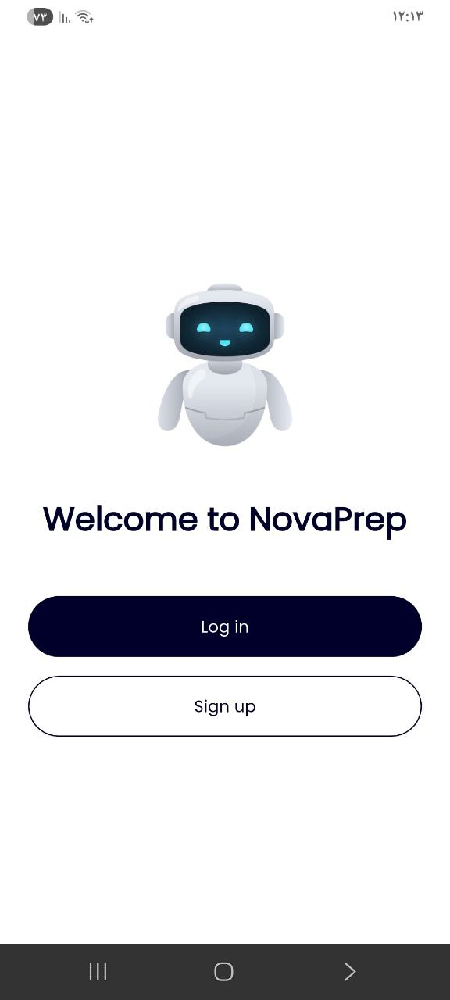
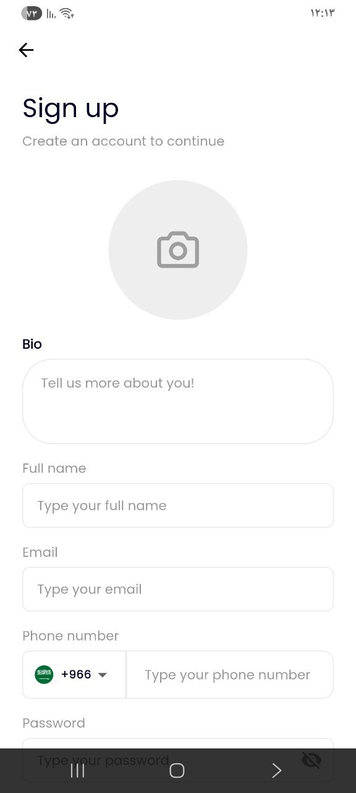
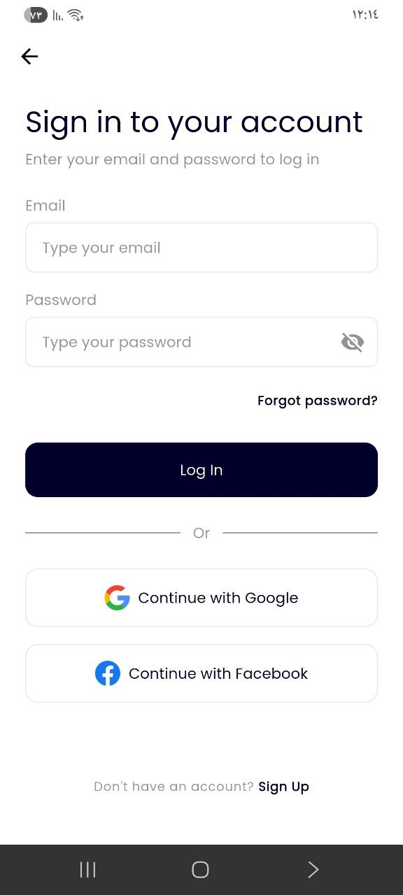
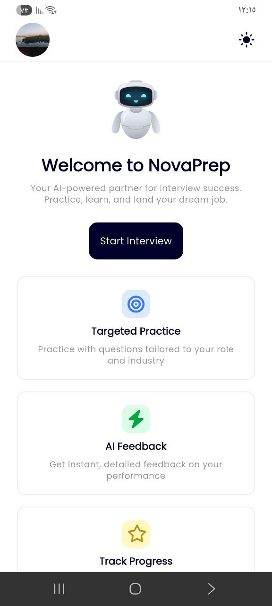
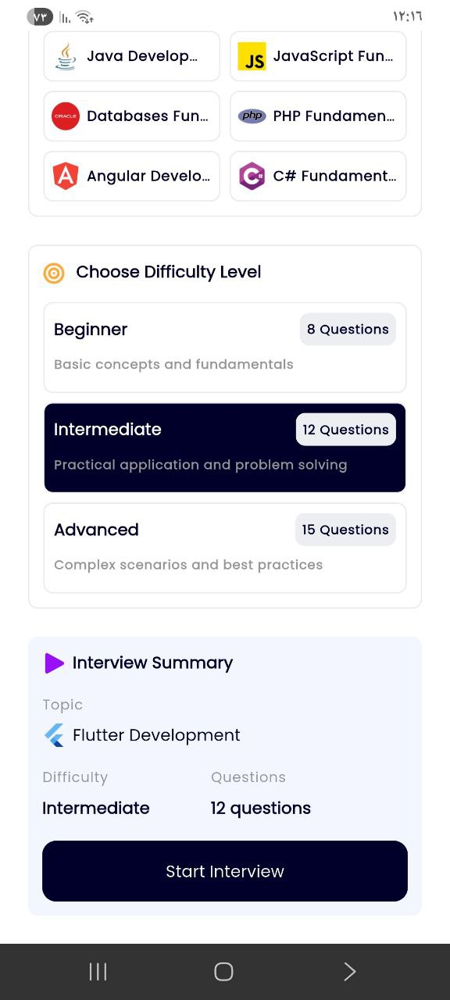
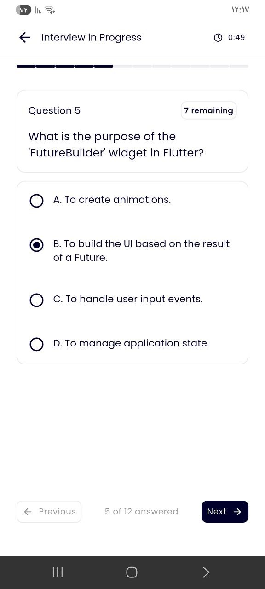
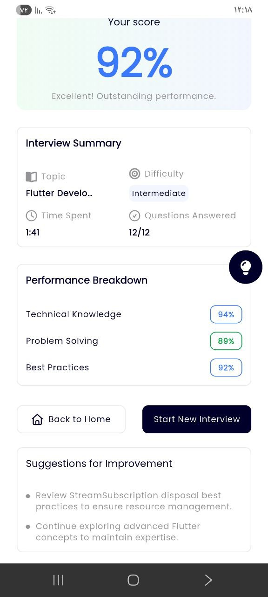
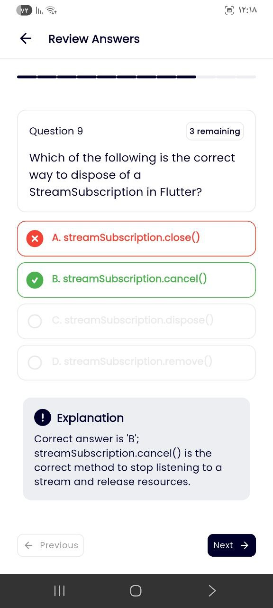

# NovaPrep - AI-Powered Interview Practice Platform

<div align="center">


**Your AI-powered partner for interview success. Practice, learn, and land your dream job.**

[Features](#features) • [Screenshots](#screenshots) • [Tech Stack](#tech-stack) • [Getting Started](#getting-started) • [Architecture](#architecture)

</div>

---

## 📋 Overview

NovaPrep is a comprehensive mobile application designed to help developers ace their technical interviews. Powered by Google's Gemini AI, the app generates intelligent, contextually relevant interview questions across multiple programming domains and difficulty levels, providing instant feedback and detailed performance analytics.

<div align="center">

[](https://www.linkedin.com/posts/mahmoud-mohamed-3b7088247_flutter-mobile-dart-activity-7379357740139356160-Gwiq?utm_source=share&utm_medium=member_android&rcm=ACoAAD0OsDsBqjAWxIyfTEg7DKjzWpFom5bCkyQ)

</div>

## ✨ Features

### 🎯 Targeted Practice
- **Multi-Domain Support**: Flutter, React, Node.js, Python, Java, JavaScript, Databases, PHP, Angular, and C#
- **Three Difficulty Levels**: 
  - Beginner (8 questions) - Basic concepts and fundamentals
  - Intermediate (12 questions) - Practical application and problem solving
  - Advanced (15 questions) - Complex scenarios and best practices

### 🤖 AI-Powered Intelligence
- **Dynamic Question Generation**: Gemini AI generates contextually relevant questions tailored to your selected topic
- **Instant Feedback**: Get detailed explanations for correct and incorrect answers
- **Smart Difficulty Adjustment**: Questions adapt to your skill level

### 📊 Comprehensive Analytics
- **Performance Breakdown**: Track your scores across Technical Knowledge, Problem Solving, and Best Practices
- **Progress Tracking**: Monitor improvement across different skills over time
- **Session History**: Review past interview sessions with detailed statistics
- **Score Metrics**: Track questions practiced, average scores, and skills improved

### 👤 User Experience
- **Clean, Modern UI**: Intuitive interface with smooth animations
- **Profile Management**: Customizable user profiles with bio and contact information
- **Session Management**: Save and review all your practice sessions
- **Progress Visualization**: Beautiful charts and statistics to visualize your growth

## 📱 Screenshots

<div align="center">

### Authentication & Onboarding
| Welcome Screen | Sign Up | Sign In |
|:---:|:---:|:---:|
|  |  |  |

### Main Features
| Home Dashboard | Interview Setup | Question Interface |
|:---:|:---:|:---:|
|  |  |  |

### Results & Profile
| Interview Results | Performance Breakdown | User Profile |
|:---:|:---:|:---:|
|  |  |  |

</div>

## 🛠️ Tech Stack

- **Framework**: Flutter 3.x
- **Language**: Dart
- **AI Integration**: Google Gemini AI API
- **State Management**: Provider / Bloc (as applicable)
- **Authentication**: Firebase Auth / Custom Backend
- **Database**: Firebase Firestore / SQLite
- **UI Components**: Material Design 3
- **Analytics**: Custom tracking system

## 🚀 Getting Started

### Prerequisites

```bash
flutter --version  # Flutter 3.0 or higher
dart --version     # Dart 3.0 or higher
```

### Installation

1. **Clone the repository**
```bash
git clone https://github.com/yourusername/novaprep.git
cd novaprep
```

2. **Install dependencies**
```bash
flutter pub get
```

3. **Configure Gemini AI API**
   - Get your API key from [Google AI Studio](https://makersuite.google.com/app/apikey)
   - Create a `.env` file in the root directory:
```env
GEMINI_API_KEY=your_api_key_here
```

4. **Run the app**
```bash
flutter run
```

## 📂 Project Structure

```
lib/
├── ai/
│   ├── config/
│   ├── models/
│   └── services/
│   └── utilities/
├── backend/
│   ├── models/
│   └── services/
├── core/
│   ├── constants/
│   ├── theme/
│   ├── utilities/
│   ├── widgets/
│   └── routing/
├── cubits/
│   ├── auth_cubit.dart
│   ├── auth_state.dart
│   └── quiz_cubit.dart
│   └── ...
├── views/
│   ├── auth_view/
│   ├── home_view/
│   ├── profile_view/
│   ├── quiz_view/
└── main.dart
└── my_app.dart
```

### Key Components

- **Gemini Service**: Handles AI question generation and processing
- **Interview Engine**: Manages question flow, timing, and scoring
- **Analytics Module**: Tracks and processes performance metrics
- **State Management**: Reactive state updates across the app

## 🎓 How It Works

1. **Select Your Topic**: Choose from 10+ programming domains
2. **Pick Difficulty**: Select Beginner, Intermediate, or Advanced
3. **Start Interview**: Gemini AI generates relevant questions
4. **Answer & Learn**: Get instant feedback with detailed explanations
5. **Review Performance**: Analyze your scores across multiple dimensions
6. **Track Progress**: Monitor improvement over time

## 🤝 Contributing

Contributions are welcome! Please feel free to submit a Pull Request.

1. Fork the project
2. Create your feature branch (`git checkout -b feature/AmazingFeature`)
3. Commit your changes (`git commit -m 'Add some AmazingFeature'`)
4. Push to the branch (`git push origin feature/AmazingFeature`)
5. Open a Pull Request

## 👨‍💻 Author

**Mahmoud Mohamed**
- Email: mahmoud@gmail.com
- Phone: +20 1127243403
- Location: Minya, Egypt

## 🙏 Acknowledgments

- Google Gemini AI for powering the intelligent question generation
- Flutter team for the amazing framework
- All contributors and testers who helped improve this project

---

<div align="center">

**Made with ❤️ using Flutter and Gemini AI**

⭐ Star this repo if you find it helpful!

</div>